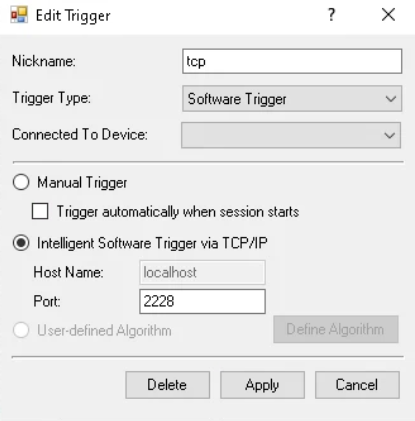

# Automatic Photo-picking

## Setup

### PolyScan

The setup of PolyScan comes first. **The termination of the program should begin with Polyscan as well.**

#### Polyecho software trigger

* name: should be consistent with the Python server's config. (default: 'tcp')
* port: 2228
* signal: pulse
  * with pulse length (exposure time) <= pulse period.
* laser connected to the trigger
  * You can check it by manually triggering in PolyScan, with a shape on in Polygon. 

#### Polygon server
Turn on the server, port 2222.

### Python segmentation server

**After setting up PolyScan servers**, run the script in this repo to start a server that constantly monitors if any new image to segment is generated and submit the segmentation to Polyscan. You should modify the config file accordingly.

Once started, both connections to 2222 and 2228 should be updated frequently, and **the config file will only be loaded once**.

### Zen

#### Channel sequence

* Set 1 channel for cell and crystal detection. By default, we use EGFP. If changed, the config should be modified.
* **Immediately after**, set 1 channel for exposure, intensity minimum. Its timeelapse should be long enough for the cycle to complete image segmentation and exposure. 

#### Exportation
Turn on Automatic Exportation, set the temp image path the same with config.
* This is for generating temporary jpg for segmentation. Once a new tile is captured, the new jpg will be detected
* Note this is different with automatic save

Finally, you can start running tile scans in Zen.